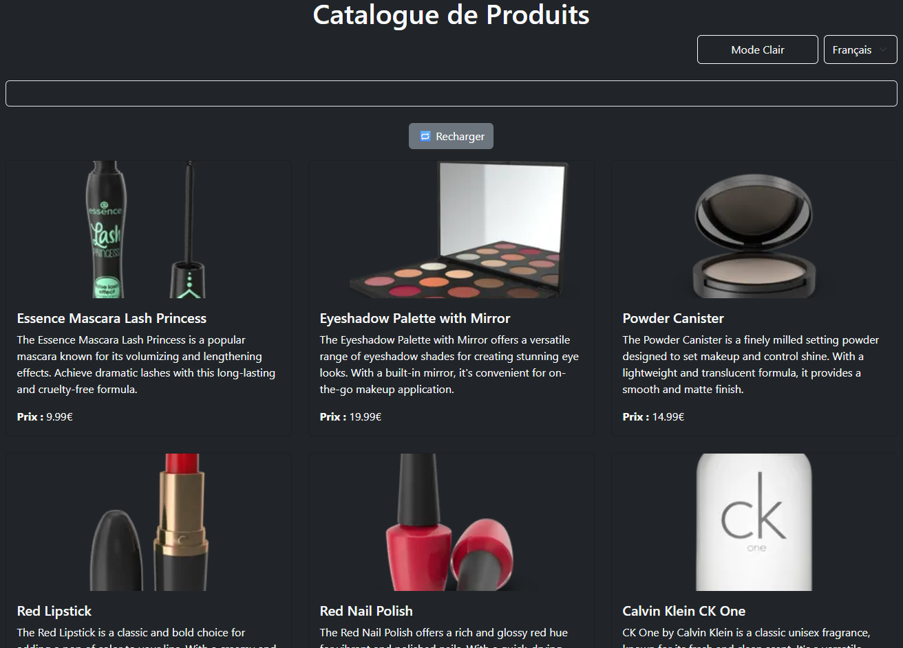
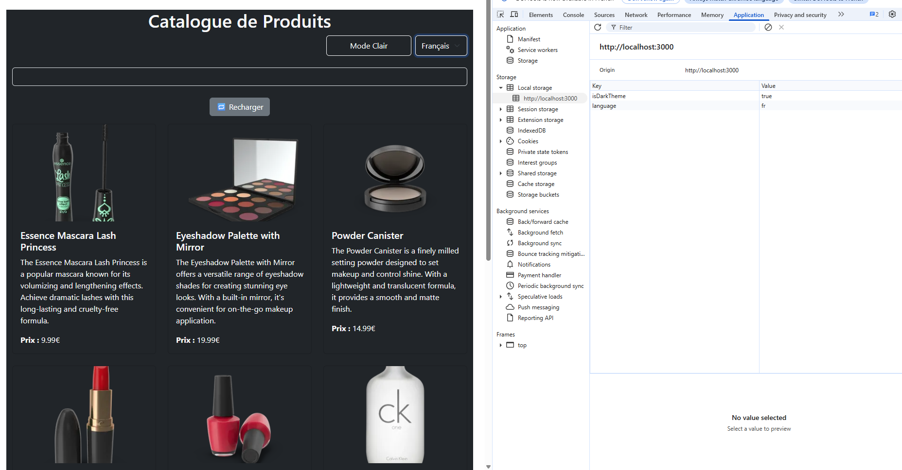
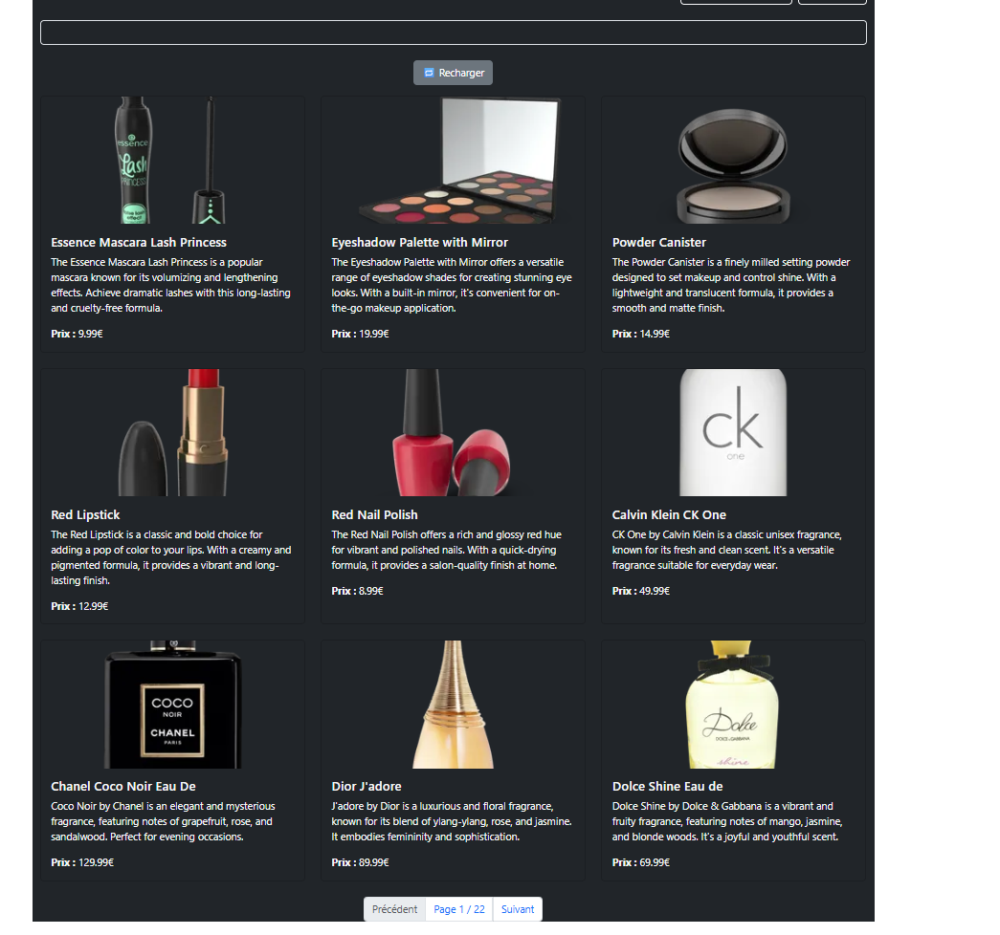

Voici le **fichier `README.md` complet**, propre et prêt à être copié dans ton dépôt GitHub :

---

````md
# TP React Hooks - Application de Gestion de Produits

Ce TP a pour objectif de mettre en pratique l'utilisation des Hooks React (`useState`, `useEffect`, `useContext`) ainsi que la création de Hooks personnalisés (`useDebounce`, `useLocalStorage`).

---

## 🚀 Installation

```bash
git clone https://github.com/AyoubdDev/tp-react-hooks-ayoub.git
cd tp-react-hooks-ayoub
npm install
npm start
````

---

## 📚 Instructions Générales

Pour chaque exercice :

1. Lire attentivement l'énoncé
2. Implémenter la solution
3. Tester et capturer le résultat
4. Mettre à jour ce fichier `README.md`
5. Faire un commit avec un message clair (`Exercice 1 : useState`...)

---

## ✅ Exercice 1 : État et Effets

### 🔹 1.1 Recherche

J’ai utilisé `useState` dans `ProductSearch` pour stocker le texte de recherche. Le texte est ensuite utilisé par le hook `useProductSearch` pour filtrer les produits.

### 🔹 1.2 useDebounce

Création d’un hook `useDebounce` qui retourne la valeur tapée avec un délai de 500ms. Il permet d’éviter les appels réseau à chaque frappe.

### 🧠 Difficultés

* Synchronisation entre la recherche et le chargement.
* Contrôle du délai pour améliorer l’expérience utilisateur.

### 📸 Capture :


---

## ✅ Exercice 2 : Context et Internationalisation

### 🔹 2.1 LanguageContext

Création d’un `LanguageContext` dans `App.jsx` avec un état `language` (`fr` ou `en`). Il est utilisé dans tous les composants pour adapter le texte.

### 🔹 2.2 Sélecteur de langue

Ajout d’un `<select>` dans l’en-tête de l’application. Les textes changent automatiquement selon la langue choisie.

### 🧠 Difficultés

* Organisation des traductions (`fr` / `en`)
* Gestion du changement dynamique

### 📸 Capture :



---

## ✅ Exercice 3 : Hooks Personnalisés

### 🔹 3.1 useDebounce

Voir exercice 1.2 – utilisé pour la recherche avec délai.

### 🔹 3.2 useLocalStorage

Création d’un hook qui lit/écrit dans `localStorage`. Il est utilisé pour sauvegarder :

* Le thème (sombre ou clair)
* La langue choisie

### 📸 Capture :



---

## ✅ Exercice 4 : Gestion Asynchrone et Pagination

### 🔹 4.1 Rechargement

Ajout d’un bouton "🔄 Recharger" qui relance manuellement le `fetch` des produits.

### 🔹 4.2 Pagination

Affichage de 9 produits par page avec boutons `Précédent` et `Suivant`. Les états `currentPage` et `totalPages` sont gérés dans le hook.

### 🧠 Difficultés

* Gestion dynamique des pages
* Synchronisation entre recherche, chargement et pagination

### 📸 Capture :



---

## 📝 Rendu Final

* ✅ Projet complet avec les 4 exercices terminés
* ✅ README documenté avec captures
* ✅ Commit clair pour chaque étape (`Exercice 2 : Context`)
* ✅ Lien GitHub à envoyer dans Classroom :

🔗 **Lien du projet** : [https://github.com/AyoubdDev/tp-react-hooks-ayoub](https://github.com/AyoubdDev/tp-react-hooks-ayoub)

---

## 👨‍💻 Auteur

* **Nom :** Hilali Ayoub


